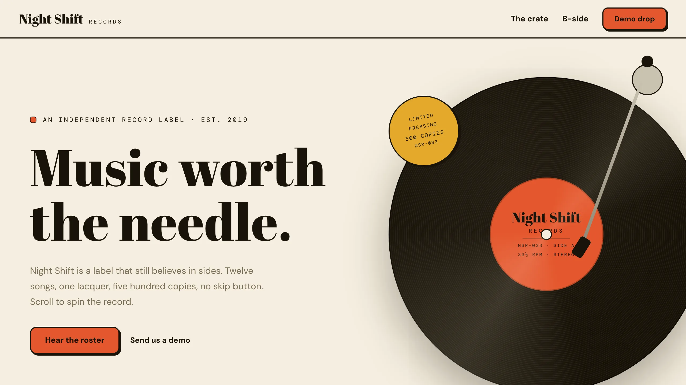
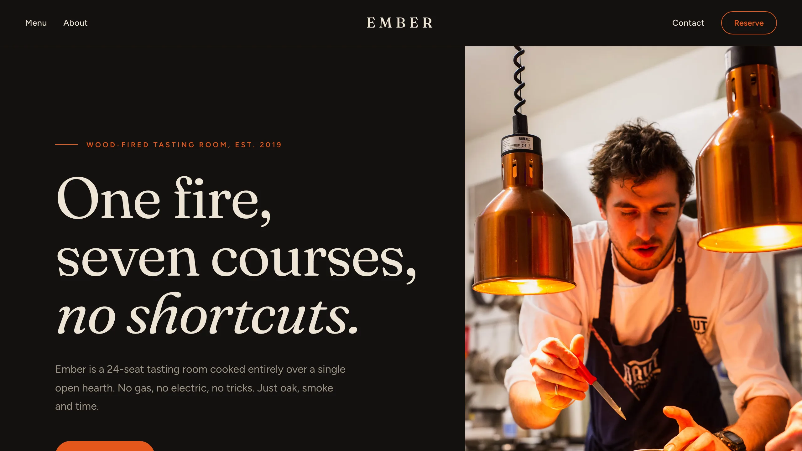

# Builder Hub

A centralized hub of [Frappe Builder](https://github.com/frappe/builder) page templates
(and, in future, plugins and components). Builder sites fetch the catalog and per-page
bundles from a Builder Hub site over HTTP, so templates get their own release cycle -
users always get the latest without upgrading the builder app.

Each template is a real Builder Page (`is_template = 1`) grouped under a `template_group`,
sharing a set of Builder Components and Variables. Groups are bundled as fixtures under
`builder_hub/builder_templates/<group>/` and synced into the hub site on install/migrate.

## Templates

Thirty multi-page template groups. Each group owns a distinct structural
archetype and shares a navbar/footer, palette (as Builder Variables) and client
scripts across its pages. Themed groups ship a light/dark toggle; single-theme
groups (dark posters, paper zines) are one look by design.

Each group carries one or more picker categories in its `template.json` manifest
(the gallery lists a group under every category it has; below, each appears once
under its primary category).
`builder_templates/PLAN.md` tracks the archetype registry, category matrix and
per-template briefs.

### Marketing

| Template | Preview |
|---|---|
| **Fronds**<br>An earthy starter site for boutique brands.<br><sub>Pages: Landing · About · Contact · Also in: Local business</sub> |  |
| **Verge**<br>A dark music artist site with poster covers and a tour list.<br><sub>Pages: Home · Shows · About · Also in: Portfolio</sub> |  |
| **Bureau**<br>A bold agency site: mega type, typographic case covers, an acid accent.<br><sub>Pages: Home · Work · Contact · Also in: Portfolio</sub> |  |
| **Candor**<br>A statement-first advisory site: one color, giant serif, a fee table, no photos.<br><sub>Pages: Home · Work · Start</sub> |  |
| **Recipe**<br>An agency as recipe cards: ruled index cards, chef's notes, a tear-off coupon.<br><sub>Pages: Home · Menu · Kitchen</sub> |  |
| **Fetch**<br>A playful one-product site: rounded color blocks, big dog photos, forever guarantee.<br><sub>Pages: Home · Collar · Help</sub> |  |
| **Groove**<br>A vinyl label where the record spins as you scroll: tonearm progress, ejecting sleeves, a runout-groove footer.<br><sub>Pages: Home · The crate · B-side</sub> |  |

### Portfolio

| Template | Preview |
|---|---|
| **Mono**<br>A dark, bold type portfolio for studios and freelancers.<br><sub>Pages: Home · Project · About · Contact</sub> |  |
| **Verso**<br>An ultra minimal personal site with a fixed sidebar.<br><sub>Pages: Home · Work · Writing · About</sub> |  |
| **Husk**<br>A warm, centered single column personal site.<br><sub>Pages: Home · Work · About</sub> |  |
| **Ridge**<br>A dark photography portfolio built as a gapless photo mosaic wall.<br><sub>Pages: Home · Series · Info</sub> |  |
| **Canvas**<br>A designer portfolio presented as a live design file, comments left in.<br><sub>Pages: Home · Work · About</sub> |  |
| **Vitae**<br>A consultant's CV presented as a crisp paper sheet on a desk.<br><sub>Pages: Home · Engagements · Contact</sub> |  |
| **Reel**<br>A filmmaker portfolio of letterboxed stills with timecode captions.<br><sub>Pages: Films · Film · About</sub> |  |
| **Margin**<br>A writer's site with a reading column and numbered margin notes.<br><sub>Pages: Home · Essays · About · Also in: Editorial</sub> |  |
| **Plinth**<br>A minimal architect portfolio: a type-only index with hover thumbnails.<br><sub>Pages: Home · Project · Profile</sub> |  |
| **Scrap**<br>A cut-and-paste zine portfolio: torn panels, tape, xerox photos, marker notes.<br><sub>Pages: Home · Werk · About</sub> |  |
| **Affiche**<br>A Swiss poster portfolio: every section is a full-screen typographic poster.<br><sub>Pages: Home · Arbeit · Kontakt · Also in: Marketing</sub> |  |
| **Annum**<br>A one-project-a-year portfolio: full-bleed hero, photo timeline, honest ledger.<br><sub>Pages: Home · Ledger · About</sub> |  |

### Editorial

| Template | Preview |
|---|---|
| **Quill**<br>A clean editorial template for blogs and publications.<br><sub>Pages: Home · Article · About</sub> |  |
| **Field**<br>A newspaper style travel journal with a three column front page.<br><sub>Pages: Issues · Story · About</sub> |  |

### Local business

| Template | Preview |
|---|---|
| **Lull**<br>A soft wellness studio with an arch photo hero and a weekly schedule.<br><sub>Pages: Home · Classes · Visit</sub> |  |
| **Nook**<br>A photo first boutique stay with full screen room chapters.<br><sub>Pages: Home · Rooms · Visit</sub> |  |
| **Keys**<br>A property agency in an app shell, with listings as rows.<br><sub>Pages: Listings · Property · Viewings</sub> |  |

### Fashion

| Template | Preview |
|---|---|
| **Hem**<br>A minimal atelier site framed by a hairline border, with numbered services.<br><sub>Pages: Home · Services · Studio · Also in: Local business</sub> |  |
| **Silk**<br>A dark evening-wear house with mirrored splits and a champagne hairline.<br><sub>Pages: Home · Collection · House · Appointments</sub> |  |
| **Tulle**<br>A blush bridal boutique with layered tissue panels and script accents.<br><sub>Pages: Home · Dresses · Visit · Also in: Local business</sub> |  |
| **Denim**<br>A loud streetwear drop site with thick borders, tickers and price stickers.<br><sub>Pages: Home · Drops · Story · Stockists · Also in: Marketing</sub> |  |
| **Pleat**<br>An editorial lookbook shot as magazine spreads with folio bars.<br><sub>Pages: Home · Looks · Studio · Also in: Editorial</sub> |  |

### Food & Beverage

| Template | Preview |
|---|---|
| **Ember**<br>A dark wood-fire tasting room: hearth-lit photography, a framed menu card and scroll-reveal motion.<br><sub>Pages: Home · Menu · About · Contact</sub> |  |

### Technology

| Template | Preview |
|---|---|
| **Encore**<br>A SaaS site staged as a product keynote: spotlight, demo, reveals, one more thing.<br><sub>Pages: Home · Pricing · Backstage · Also in: Marketing</sub> |  |
| **Aurora**<br>A dark, glowing SaaS landing: gradient hero, glass bento grid, testimonial wall.<br><sub>Pages: Home · Pricing · Contact · Also in: Marketing</sub> |  |

## How it works

- **`builder_hub.api.get_catalog()`** (guest) - returns the template groups (with their
  categories) + their pages with absolute preview and `live_url`s, for any builder site's
  template picker.
- **`builder_hub.api.get_template_bundle(page)`** (guest) - returns one template page plus
  its shared components, variables, client scripts and fonts as import-ready dicts.
- A builder site points at the hub via `template_hub_url` in its site config (or
  `common_site_config.json` bench-wide), fetches the catalog, and materializes a page from
  the bundle on demand. The "Preview" action embeds the hub's published page inline in the
  picker, with desktop, tablet, and mobile widths.

Template content lives in this app; the import/export machinery lives in `builder`
(`builder.template_sync`), which this app reuses - `builder_hub` depends on `builder`.

## Installation

You can install this app using the [bench](https://github.com/frappe/bench) CLI:

```bash
cd $PATH_TO_YOUR_BENCH
bench get-app $URL_OF_THIS_REPO --branch develop
bench install-app builder_hub
```

`builder_hub` requires the `builder` app (installed automatically as a dependency).

## Contributing

This app uses `pre-commit` for code formatting and linting. Please [install pre-commit](https://pre-commit.com/#installation) and enable it for this repository:

```bash
cd apps/builder_hub
pre-commit install
```

Pre-commit is configured to use the following tools for checking and formatting your code:

- ruff
- eslint
- prettier
- pyupgrade

## License

mit
